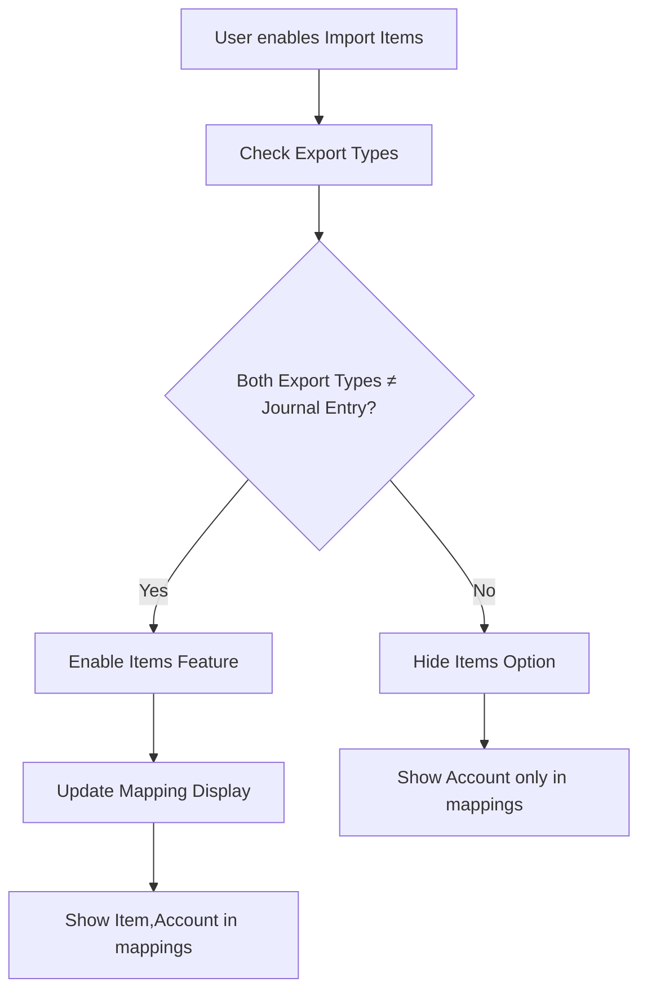

# QBO Items Feature - Comprehensive Documentation

## Table of Contents
1. [Overview](#overview)
2. [Feature Architecture](#feature-architecture)
3. [Data Models](#data-models)
4. [Core Implementation](#core-implementation)
5. [UI Components](#ui-components)
6. [Business Logic](#business-logic)
7. [Integration Points](#integration-points)
8. [Testing](#testing)
9. [Configuration & Branding](#configuration--branding)
10. [File Structure](#file-structure)

---

## Overview

The QBO Items feature allows users to import **Products/Services** from QuickBooks Online as **Categories** in Fyle. This feature provides enhanced mapping capabilities by allowing users to map expense categories to either QBO Items or QBO Accounts.

### Key Characteristics:
- **Purpose**: Import QBO Products/Services as Fyle expense categories
- **Availability**: Only when export types are NOT Journal Entry
- **Impact**: Changes mapping display to show "Item,Account" instead of just "Account"
- **Warning System**: Alerts users when changing to Journal Entry export type

---

## Feature Architecture

### Core Property
The entire feature is controlled by a single boolean property: `import_items`

```typescript
// Location: src/app/core/models/qbo/db/workspace-general-setting.model.ts:13
import_items: boolean;
```

### Feature Flow


---

## Data Models

### 1. Workspace General Setting Model

**File**: `src/app/core/models/qbo/db/workspace-general-setting.model.ts`

```typescript
export type QBOWorkspaceGeneralSetting = {
  id: number;
  import_projects: boolean;
  created_at: Date;
  updated_at: Date;
  workspace: number;
  employee_field_mapping: EmployeeFieldMapping;
  auto_map_employees: AutoMapEmployeeOptions | null;
  reimbursable_expenses_object: QBOReimbursableExpensesObject | null;
  corporate_credit_card_expenses_object: QBOCorporateCreditCardExpensesObject | null;
  import_categories: boolean;
  import_items: boolean;  // ← THE CORE PROPERTY
  import_vendors_as_merchants: boolean;
  charts_of_accounts: string[];
  import_tax_codes: boolean;
  sync_fyle_to_qbo_payments: boolean;
  sync_qbo_to_fyle_payments: boolean;
  auto_create_destination_entity: boolean;
  auto_create_merchants_as_vendors: boolean,
  je_single_credit_line: boolean;
  change_accounting_period: boolean;
  memo_structure: string[];
  category_sync_version: string;
  map_fyle_cards_qbo_account: boolean;
  map_merchant_to_vendor: boolean;
  name_in_journal_entry: NameInJournalEntry;
};
```

### 2. Import Settings Model

**File**: `src/app/core/models/qbo/qbo-configuration/qbo-import-setting.model.ts`

```typescript
// Import Settings Workspace General Setting Type
export type QBOImportSettingWorkspaceGeneralSetting = {
  import_categories: boolean,
  import_items: boolean,
  import_vendors_as_merchants: boolean,
  charts_of_accounts: string[],
  import_tax_codes: boolean,
  import_code_fields: string[]
}

// POST payload structure
export type QBOImportSettingPost = {
  workspace_general_settings: QBOImportSettingWorkspaceGeneralSetting,
  general_mappings: QBOImportSettingGeneralMapping,
  mapping_settings: ImportSettingMappingRow[] | []
}

// GET response structure
export type QBOImportSettingGet = {
  workspace_general_settings: QBOImportSettingWorkspaceGeneralSetting,
  general_mappings: QBOImportSettingGeneralMapping,
  mapping_settings: MappingSetting[],
  workspace_id: number
}
```

### 3. Form Mapping Implementation

**File**: `src/app/core/models/qbo/qbo-configuration/qbo-import-setting.model.ts:41-59`

```typescript
static mapAPIResponseToFormGroup(
  importSettings: QBOImportSettingGet | null, 
  qboFields: IntegrationField[], 
  qboImportCodeFieldCodeConfig: ImportCodeFieldConfigType
): FormGroup {
  const importCode = importSettings?.workspace_general_settings?.import_code_fields ? 
    importSettings?.workspace_general_settings?.import_code_fields : [];
  const expenseFieldsArray = importSettings?.mapping_settings ? 
    this.constructFormArray(importSettings.mapping_settings, qboFields, qboImportCodeFieldCodeConfig) : [];
  
  return new FormGroup({
    importCategories: new FormControl(importSettings?.workspace_general_settings.import_categories ?? false),
    expenseFields: new FormArray(expenseFieldsArray),
    chartOfAccountTypes: new FormControl(importSettings?.workspace_general_settings.charts_of_accounts ? 
      importSettings.workspace_general_settings.charts_of_accounts : ['Expense']),
    importItems: new FormControl(importSettings?.workspace_general_settings.import_items ?? false), // ← Form control for items
    taxCode: new FormControl(importSettings?.workspace_general_settings.import_tax_codes ?? false),
    importVendorsAsMerchants: new FormControl(importSettings?.workspace_general_settings.import_vendors_as_merchants ?? false),
    defaultTaxCode: new FormControl(importSettings?.general_mappings?.default_tax_code?.id ? 
      importSettings.general_mappings.default_tax_code : null),
    searchOption: new FormControl(''),
    importCodeFields: new FormControl(importSettings?.workspace_general_settings?.import_code_fields ? 
      importSettings.workspace_general_settings.import_code_fields : null),
    importCategoryCode: new FormControl(this.getImportCodeField(importCode, 'ACCOUNT', qboImportCodeFieldCodeConfig))
  });
}
```

### 4. Payload Construction

**File**: `src/app/core/models/qbo/qbo-configuration/qbo-import-setting.model.ts:61-75`

```typescript
static constructPayload(importSettingsForm: FormGroup): QBOImportSettingPost {
  const emptyDestinationAttribute = {id: null, name: null};
  const expenseFieldArray = importSettingsForm.getRawValue().expenseFields;
  const mappingSettings = this.constructMappingSettingPayload(expenseFieldArray);

  return {
    workspace_general_settings: {
      import_categories: importSettingsForm.get('importCategories')?.value,
      import_items: importSettingsForm.get('importItems')?.value,  // ← Extract items value from form
      charts_of_accounts: importSettingsForm.get('chartOfAccountTypes')?.value,
      import_tax_codes: importSettingsForm.get('taxCode')?.value,
      import_vendors_as_merchants: importSettingsForm.get('importVendorsAsMerchants')?.value,
      import_code_fields: importSettingsForm.get('importCodeFields')?.value
    },
    mapping_settings: mappingSettings,
    general_mappings: {
      default_tax_code: importSettingsForm.get('defaultTaxCode')?.value ? 
        importSettingsForm.get('defaultTaxCode')?.value : emptyDestinationAttribute
    }
  };
}
```

---

## Core Implementation

### 1. Import Settings Component

**File**: `src/app/integrations/qbo/qbo-shared/qbo-import-settings/qbo-import-settings.component.ts`

#### Component Properties
```typescript
export class QboImportSettingsComponent implements OnInit {
  isLoading: boolean = true;
  supportArticleLink: string = brandingKbArticles.onboardingArticles.QBO.IMPORT_SETTING;
  isOnboarding: boolean;
  brandingConfig = brandingConfig;
  appName: AppName = AppName.QBO;
  importSettingForm: FormGroup;  // ← Contains importItems form control
  qboFields: IntegrationField[];
  fyleFields: FyleField[];
  isSaveInProgress: boolean;
  ConfigurationCtaText = ConfigurationCta;
  
  // ... other properties
  
  workspaceGeneralSettings: QBOWorkspaceGeneralSetting;  // ← Contains import_items property
  QBOReimbursableExpensesObject = QBOReimbursableExpensesObject;
  QBOCorporateCreditCardExpensesObject = QBOCorporateCreditCardExpensesObject;
  
  // ... rest of properties
}
```

#### Save Method
```typescript
// File: src/app/integrations/qbo/qbo-shared/qbo-import-settings/qbo-import-settings.component.ts:148-162
save(): void {
  this.isSaveInProgress = true;
  const importSettingPayload = QBOImportSettingModel.constructPayload(this.importSettingForm);
  this.importSettingService.postImportSettings(importSettingPayload).subscribe(() => {
    this.isSaveInProgress = false;
    this.toastService.displayToastMessage(ToastSeverity.SUCCESS, 'Import settings saved successfully');
    this.updateImportCodeFieldConfig();
    if (this.isOnboarding) {
      this.workspaceService.setOnboardingState(QBOOnboardingState.ADVANCED_CONFIGURATION);
      this.router.navigate([`/integrations/qbo/onboarding/advanced_settings`]);
    }
  }, () => {
    this.isSaveInProgress = false;
    this.toastService.displayToastMessage(ToastSeverity.ERROR, 'Error saving import settings, please try again later');
  });
}
```

#### Setup Page Method
```typescript
// File: src/app/integrations/qbo/qbo-shared/qbo-import-settings/qbo-import-settings.component.ts:265-297
private setupPage(): void {
  this.isOnboarding = this.router.url.includes('onboarding');
  forkJoin([
    this.importSettingService.getImportSettings(),
    this.mappingService.getFyleFields('v1'),
    this.workspaceService.getWorkspaceGeneralSettings(),
    this.qboConnectorService.getQBOCredentials(),
    this.mappingService.getDestinationAttributes(QBOField.TAX_CODE, 'v1', 'qbo'),
    this.importSettingService.getQBOFields(),
    this.importSettingService.getImportCodeFieldConfig()
  ]).subscribe(([importSettingsResponse, fyleFieldsResponse, workspaceGeneralSettings, qboCredentials, taxCodes, qboFields, importCodeFieldConfig]) => {
    this.qboFields = qboFields;
    this.importSettings = importSettingsResponse;
    this.workspaceGeneralSettings = workspaceGeneralSettings;  // ← Contains import_items
    this.taxCodes = taxCodes.map((option: DestinationAttribute) => QBOExportSettingModel.formatGeneralMappingPayload(option));
    this.isImportMerchantsAllowed = !workspaceGeneralSettings.auto_create_merchants_as_vendors;

    if (qboCredentials && qboCredentials.country !== 'US') {
      this.isTaxGroupSyncAllowed = true;
    }

    this.qboImportCodeFieldCodeConfig = importCodeFieldConfig;
    this.importSettingForm = QBOImportSettingModel.mapAPIResponseToFormGroup(this.importSettings, this.qboFields, this.qboImportCodeFieldCodeConfig);
    this.fyleFields = fyleFieldsResponse;
    this.fyleFields.push({ attribute_type: 'custom_field', display_name: 'Create a custom field', is_dependent: false });
    this.updateImportCodeFieldConfig();
    this.setupFormWatchers();
    this.initializeCustomFieldForm(false);
    this.isLoading = false;
  });
}
```

### 2. Base Mapping Component

**File**: `src/app/integrations/qbo/qbo-main/qbo-mapping/qbo-base-mapping/qbo-base-mapping.component.ts`

#### Critical Logic for Items Display
```typescript
export class QboBaseMappingComponent implements OnInit {
  isLoading: boolean = true;
  destinationOptions: DestinationAttribute[];
  employeeFieldMapping: FyleField;
  sourceField: string;
  destinationField: string;
  showAutoMapEmployee: boolean;
  reimbursableExpenseObject: QBOReimbursableExpensesObject | null;
  cccExpenseObject: QBOCorporateCreditCardExpensesObject | null;
  AppName = AppName;
  FyleField = FyleField;
  displayName: string | undefined = undefined;  // ← Key property for items display
  isMultiLineOption: boolean;
  brandingConfig = brandingConfig;
  destinationAttributes: string | string[];

  // ... constructor and other methods

  private setupPage(): void {
    this.sourceField = decodeURIComponent(this.route.snapshot.params.source_field.toUpperCase());
    forkJoin([
      this.workspaceService.getWorkspaceGeneralSettings(),
      this.mappingService.getMappingSettings(),
      this.importSettingsService.getImportSettings()
    ]).subscribe((responses) => {
      this.reimbursableExpenseObject = responses[0].reimbursable_expenses_object;
      this.cccExpenseObject = responses[0].corporate_credit_card_expenses_object;
      this.employeeFieldMapping = (responses[0].employee_field_mapping as unknown as FyleField);
      this.showAutoMapEmployee = responses[0].auto_map_employees ? true : false;
      this.destinationField = this.getDestinationField(responses[0], responses[1].results);

      if (this.destinationField === QboExportSettingDestinationOptionKey.CREDIT_CARD_ACCOUNT && this.cccExpenseObject === QBOCorporateCreditCardExpensesObject.DEBIT_CARD_EXPENSE) {
        this.destinationAttributes = [QboExportSettingDestinationOptionKey.CREDIT_CARD_ACCOUNT, QboExportSettingDestinationOptionKey.BANK_ACCOUNT];
      } else {
        this.destinationAttributes = this.destinationField;
      }

      this.isMultiLineOption = responses[2].workspace_general_settings.import_code_fields?.includes(this.destinationField);

      // ← CRITICAL LOGIC: Display name changes based on import_items
      if (this.destinationField === AccountingField.ACCOUNT) {
        this.displayName = responses[0].import_items ? 
          `${AccountingDisplayName.ITEM},${AccountingDisplayName.ACCOUNT}` : 
          AccountingDisplayName.ACCOUNT;
      } else {
        this.displayName = undefined;
      }

      this.mappingService.getPaginatedDestinationAttributes(this.destinationAttributes, undefined, this.displayName).subscribe((responses) => {
        this.destinationOptions = responses.results;
        this.isLoading = false;
      });
    });
  }
}
```

### 3. Dashboard Integration

**File**: `src/app/integrations/qbo/qbo-main/qbo-dashboard/qbo-dashboard.component.ts`

```typescript
export class QboDashboardComponent implements OnInit, OnDestroy {
  // ... other properties
  
  isImportItemsEnabled: boolean;  // ← Dashboard property to track items feature

  // ... other properties

  private setupPage(): void {
    forkJoin([
      this.getExportErrors$,
      this.getAccountingExportSummary$.pipe(catchError(() => of(null))),
      this.dashboardService.getAllTasks([TaskLogState.ENQUEUED, TaskLogState.IN_PROGRESS, TaskLogState.FAILED], undefined, this.accountingExportType),
      this.workspaceService.getWorkspaceGeneralSettings(),
      this.dashboardService.getExportableAccountingExportIds('v1'),
      this.qboExportSettingsService.getExportSettings(),
      this.importSettingService.getImportSettings()
    ]).subscribe((responses) => {
      this.errors = DashboardModel.parseAPIResponseToGroupedError(responses[0]);
      this.isImportItemsEnabled = responses[3].import_items;  // ← Extract from workspace general settings
      if (responses[1]) {
        this.accountingExportSummary = AccountingExportSummaryModel.parseAPIResponseToAccountingSummary(responses[1]);
      }
      this.destinationFieldMap = {
        EMPLOYEE: responses[3].employee_field_mapping,
        CATEGORY: 'ACCOUNT'
      };

      this.isLoading = false;

      this.importCodeFields = responses[6].workspace_general_settings?.import_code_fields;

      // ... rest of setup logic
    });
  }
}
```

---

## UI Components

### 1. Import Settings HTML Template

**File**: `src/app/integrations/qbo/qbo-shared/qbo-import-settings/qbo-import-settings.component.html:55-70`

```html
<!-- Items Import Toggle Section -->
<div class="tw-rounded-lg tw-border-border-tertiary tw-border tw-mt-24-px" 
     *ngIf="workspaceGeneralSettings.reimbursable_expenses_object !== QBOReimbursableExpensesObject.JOURNAL_ENTRY && 
            workspaceGeneralSettings.corporate_credit_card_expenses_object !== QBOCorporateCreditCardExpensesObject.JOURNAL_ENTRY">
  <app-configuration-toggle-field
    [form]="importSettingForm"
    [label]="brandingContent.importItemsLabel"
    [subLabel]="brandingContent.importItemsSubLabel"
    [formControllerName]="'importItems'"
    [iconPath]="'arrow-tail-down'">
  </app-configuration-toggle-field>
</div>
```

#### Key UI Logic:
1. **Conditional Display**: Only shows when both export types are NOT Journal Entry
2. **Form Binding**: Binds to `importItems` form control
3. **Branding**: Uses configurable labels and sub-labels
4. **Toggle Component**: Uses reusable configuration toggle field component

### 2. Dashboard HTML Integration

**File**: `src/app/integrations/qbo/qbo-main/qbo-dashboard/qbo-dashboard.component.html:42`

```html
<app-dashboard-export-section
  [isExportInProgress]="isExportInProgress"
  [exportableAccountingExportIds]="exportableAccountingExportIds"
  [failedExpenseGroupCount]="failedExpenseGroupCount"
  [exportProgressPercentage]="exportProgressPercentage"
  [accountingExportSummary]="accountingExportSummary"
  [appName]="appName"
  [errors]="errors"
  [destinationFieldMap]="destinationFieldMap"
  [isImportItemsEnabled]="isImportItemsEnabled"  
  [reimbursableImportState]="reimbursableImportState"
  [cccImportState]="cccImportState"
  [importCodeFields]="importCodeFields">
</app-dashboard-export-section>
```

---

## Business Logic

### 1. Export Type Restrictions

The items feature has specific business rules around when it can be enabled:

```typescript
// UI Condition (from HTML template)
*ngIf="workspaceGeneralSettings.reimbursable_expenses_object !== QBOReimbursableExpensesObject.JOURNAL_ENTRY && 
       workspaceGeneralSettings.corporate_credit_card_expenses_object !== QBOCorporateCreditCardExpensesObject.JOURNAL_ENTRY"
```

**Rule**: Items can only be imported when **both** export types are **NOT** Journal Entry.

**Reasoning**: Journal entries in QBO have different line item structures that don't support the same item mapping as other export types.

### 2. Export Settings Warning Logic

**File**: `src/app/integrations/qbo/qbo-shared/qbo-export-settings/qbo-export-settings.component.ts`

```typescript
export class QboExportSettingsComponent implements OnInit {
  // ... other properties
  
  isImportItemsEnabled: boolean;  // ← Tracks if items are enabled

  // ... other methods

  private replaceContentBasedOnConfiguration(updatedConfiguration: string, existingConfiguration: string, exportType: 'reimbursable' | 'credit card'): string {
    const newConfiguration = `You have <b>selected a new export type</b> for the $exportType expense`;
    const configurationUpdate = `You have changed the export type of $exportType expense from <b>$existingExportType</b> to <b>$updatedExportType</b>,`;
    let content: string = '';

    if (existingConfiguration && existingConfiguration !== 'None') {
      content = configurationUpdate.replace('$exportType', exportType).replace('$existingExportType', existingConfiguration.toLowerCase().replace(/^\w/, (c: string) => c.toUpperCase())).replace('$updatedExportType', updatedConfiguration.toLowerCase().replace(/^\w/, (c: string) => c.toUpperCase()));
    } else {
      content = newConfiguration.replace('$exportType', exportType);
    }

    // ← CRITICAL WARNING LOGIC
    // If any export-type has been changed to journal entry and has import_items set to true, then add the below content and return
    if ((updatedConfiguration === QBOReimbursableExpensesObject.JOURNAL_ENTRY) && this.isImportItemsEnabled) {
      return `${content} <br><br>Also, Products/services previously imported as categories in ${brandingConfig.brandName} will be disabled.`;
    }
    // If any export-type is not journal entry or import_items is set to false, simply return the normal constructed content
    return content;
  }

  // ... other methods

  private getSettingsAndSetupForm(): void {
    forkJoin([
      this.exportSettingService.getExportSettings(),
      this.employeeSettingService.getEmployeeSettings(),
      this.mappingService.getQBODestinationAttributes(['VENDOR', 'ACCOUNTS_PAYABLE', 'BANK_ACCOUNT', 'CREDIT_CARD_ACCOUNT'], 'v1'),
      this.workspaceService.getWorkspaceGeneralSettings()
    ]).subscribe(([exportSettingsResponse, employeeSettingsResponse, destinationAttributes, workspaceGeneralSettings]) => {
      this.exportSettings = exportSettingsResponse;
      this.employeeSetting = employeeSettingsResponse;
      this.addMissingOptions();
      this.setLiveEntityExample(destinationAttributes);

      this.isImportItemsEnabled = workspaceGeneralSettings?.import_items || false;  // ← Extract items status

      // ... rest of setup logic
    });
  }
}
```

### 3. AccountingDisplayName Enum

**File**: `src/app/core/models/enum/enum.model.ts:845-850`

```typescript
export enum AccountingDisplayName {
  ACCOUNT = 'Account',
  ITEM = 'Item',  // ← Used in mapping display names
}
```

This enum provides the display names used in the mapping interface when items are enabled.

---

## Integration Points

### 1. Clone Settings Integration

**File**: `src/app/integrations/qbo/qbo-onboarding/qbo-clone-settings/qbo-clone-settings.component.ts`

```typescript
export class QboCloneSettingsComponent implements OnInit {
  // ... other properties
  
  isImportItemsEnabled: boolean;  // ← Clone settings also tracks items

  // ... other methods

  private setupCloneSettingsPage(data: QBOCloneSettingGet): void {
    // ... other setup logic
    
    this.isImportItemsEnabled = cloneSetting.import_settings.workspace_general_settings.import_items;

    // ... rest of setup
  }
}
```

#### Clone Settings HTML

**File**: `src/app/integrations/qbo/qbo-onboarding/qbo-clone-settings/qbo-clone-settings.component.html:333`

```html
<app-configuration-toggle-field
  [form]="cloneSettingsForm"
  [label]="brandingContent.importItemsLabel"
  [subLabel]="brandingContent.importItemsSubLabel"
  [formControllerName]="'importItems'">
</app-configuration-toggle-field>
```

### 2. Fixture Data

**File**: `src/app/integrations/qbo/qbo.fixture.ts`

The fixture file contains multiple test data objects with `import_items` property:

```typescript
// Line 354
export const mockWorkspaceGeneralSetting: QBOWorkspaceGeneralSetting = {
  // ... other properties
  import_items: false,
  // ... rest of properties
};

// Line 718
export const mockImportSettings: QBOImportSettingGet = {
  workspace_general_settings: {
    // ... other properties
    importItems: false,
    // ... rest of properties
  },
  // ... rest of structure
};

// Line 821
export const mockExportSettings: QBOExportSettingGet = {
  workspace_general_settings: {
    // ... other properties
    import_items: true,
    // ... rest of properties
  },
  // ... rest of structure
};

// Additional fixture data with import_items: true at lines 911, 1068, 1715
// Additional fixture data with import_items: false at line 2256
```

---

## Testing

### 1. Import Settings Component Tests

**File**: `src/app/integrations/qbo/qbo-shared/qbo-import-settings/qbo-import-settings.component.spec.ts`

The test file doesn't contain specific tests for the items functionality, but it would typically include:

```typescript
// Expected test structure (not in current file)
describe('QboImportSettingsComponent - Items Feature', () => {
  it('should initialize importItems form control correctly', () => {
    // Test form control initialization
  });

  it('should show items toggle when export types are not Journal Entry', () => {
    // Test UI visibility logic
  });

  it('should hide items toggle when either export type is Journal Entry', () => {
    // Test UI hiding logic
  });

  it('should save import items setting correctly', () => {
    // Test save functionality
  });
});
```

### 2. Export Settings Component Tests

**File**: `src/app/integrations/qbo/qbo-shared/qbo-export-settings/qbo-export-settings.component.spec.ts:171,627-628`

```typescript
// Existing test for items integration
expect(component.isImportItemsEnabled).toEqual(mockWorkspaceGeneralSettings.import_items);

// Test for warning message when Journal Entry is selected with items enabled
it('should include additional content when updated to JOURNAL_ENTRY and isImportItemsEnabled is true', () => {
  component.isImportItemsEnabled = true;
  const result = component['replaceContentBasedOnConfiguration'](QBOReimbursableExpensesObject.JOURNAL_ENTRY, 'EXPENSE', 'reimbursable');
  expect(result).toContain('Products/services previously imported as categories');
});
```

### 3. Dashboard Component Tests

**File**: `src/app/integrations/qbo/qbo-main/qbo-dashboard/qbo-dashboard.component.spec.ts:91`

```typescript
// Existing test for dashboard items integration
expect(component.isImportItemsEnabled).toBe(mockWorkspaceGeneralSettingsForDashboard.import_items);
```

### 4. Base Mapping Component Tests

**File**: `src/app/integrations/qbo/qbo-main/qbo-mapping/qbo-base-mapping/qbo-base-mapping.component.spec.ts`

The test file should include tests for the display name logic:

```typescript
// Expected test structure (implementation details not shown in current file)
describe('QboBaseMappingComponent - Items Feature', () => {
  it('should display "Item,Account" when import_items is true', () => {
    // Test display name logic with items enabled
  });

  it('should display "Account" when import_items is false', () => {
    // Test display name logic with items disabled
  });
});
```

---

## Configuration & Branding

### 1. Feature Flag Configuration

**File**: `src/app/core/models/branding/feature-configuration.model.ts:32`

```typescript
// Feature configuration model includes items
importItems: boolean;
```

**File**: `src/app/branding/fyle-branding-config.ts:39` & `src/app/branding/c1-branding-config.ts:39`

```typescript
// Both branding configs enable items feature
importItems: true,
```

### 2. Content Configuration

**File**: `src/app/core/models/branding/content-configuration.model.ts`

```typescript
// Import settings content configuration
export type ImportSettingsContent = {
  // ... other properties
  importItemsLabel: string;      // Line 68
  importItemsSubLabel: string;   // Line 69
  // ... other properties
};

// Clone settings content configuration  
export type CloneSettingsContent = {
  // ... other properties
  importItemsLabel: string;      // Line 146
  // ... other properties
};

// QBO specific content configuration
export type QBOContentConfig = {
  // ... other properties
  importItemsLabel: string;      // Line 380
  importItemsSubLabel: string;   // Line 381
  // ... other properties
};
```

### 3. Branding Content Implementation

**File**: `src/app/branding/fyle-contents-config.ts` & `src/app/branding/c1-content-config.ts`

```typescript
// QBO Import Settings Content
qbo: {
  // ... other content
  importItemsLabel: 'Import products/services from QuickBooks Online',
  importItemsSubLabel: 'Products/services from QuickBooks Online will be imported as categories in ' + brandingConfig.brandName + '.',
  // ... other content
}

// Clone Settings Content  
cloneSettings: {
  // ... other content
  importItemsLabel: 'Import products/services from QuickBooks Online',
  // ... other content
}

// Import Settings Content
importSetting: {
  // ... other content  
  importItemsLabel: 'Import products/services from QuickBooks Desktop',
  importItemsSubLabel: 'Products/services from QuickBooks Desktop will be imported as categories in ' + brandingConfig.brandName + '.',
  // ... other content
}
```

**Note**: The content shows that this pattern is used across multiple integrations (QBO, QBD) with appropriate product names.

---

## File Structure

### Complete File Organization

```
src/app/
├── core/
│   └── models/
│       ├── branding/
│       │   ├── content-configuration.model.ts       # Content types with importItemsLabel/SubLabel
│       │   └── feature-configuration.model.ts       # Feature flag: importItems: boolean
│       ├── enum/
│       │   └── enum.model.ts                        # AccountingDisplayName.ITEM = 'Item'
│       └── qbo/
│           ├── db/
│           │   └── workspace-general-setting.model.ts  # Core: import_items: boolean
│           └── qbo-configuration/
│               └── qbo-import-setting.model.ts      # Form mapping & payload construction
├── integrations/qbo/
│   ├── qbo-main/
│   │   ├── qbo-dashboard/
│   │   │   ├── qbo-dashboard.component.ts          # Dashboard integration: isImportItemsEnabled
│   │   │   ├── qbo-dashboard.component.html        # Dashboard UI with items flag
│   │   │   └── qbo-dashboard.component.spec.ts     # Dashboard tests
│   │   └── qbo-mapping/
│   │       └── qbo-base-mapping/
│   │           ├── qbo-base-mapping.component.ts   # CRITICAL: Display name logic
│   │           ├── qbo-base-mapping.component.html # Mapping UI
│   │           └── qbo-base-mapping.component.spec.ts  # Mapping tests
│   ├── qbo-onboarding/
│   │   └── qbo-clone-settings/
│   │       ├── qbo-clone-settings.component.ts     # Clone settings integration
│   │       ├── qbo-clone-settings.component.html   # Clone settings UI with items
│   │       └── qbo-clone-settings.component.spec.ts   # Clone settings tests
│   ├── qbo-shared/
│   │   ├── qbo-export-settings/
│   │   │   ├── qbo-export-settings.component.ts    # Warning logic for Journal Entry
│   │   │   ├── qbo-export-settings.component.html  # Export settings UI
│   │   │   └── qbo-export-settings.component.spec.ts  # Export settings tests with items
│   │   └── qbo-import-settings/
│   │       ├── qbo-import-settings.component.ts    # MAIN: Items toggle implementation
│   │       ├── qbo-import-settings.component.html  # MAIN: Items UI with conditional display
│   │       └── qbo-import-settings.component.spec.ts  # Import settings tests
│   └── qbo.fixture.ts                              # Test data with import_items values
├── branding/
│   ├── c1-branding-config.ts                       # Feature flag: importItems: true
│   ├── c1-content-config.ts                        # C1 branding content for items
│   ├── fyle-branding-config.ts                     # Feature flag: importItems: true  
│   └── fyle-contents-config.ts                     # Fyle branding content for items
```

---

## Key Implementation Details

### 1. Conditional Display Logic

The items feature is only available when both export types are not Journal Entry:

```typescript
// Template condition
*ngIf="workspaceGeneralSettings.reimbursable_expenses_object !== QBOReimbursableExpensesObject.JOURNAL_ENTRY && 
       workspaceGeneralSettings.corporate_credit_card_expenses_object !== QBOCorporateCreditCardExpensesObject.JOURNAL_ENTRY"
```

### 2. Mapping Display Enhancement

When items are enabled, the mapping interface changes from showing just "Account" to showing "Item,Account":

```typescript
// From qbo-base-mapping.component.ts:99
this.displayName = responses[0].import_items ? 
  `${AccountingDisplayName.ITEM},${AccountingDisplayName.ACCOUNT}` : 
  AccountingDisplayName.ACCOUNT;
```

### 3. Warning System

When users change to Journal Entry export type while items are enabled, they receive a specific warning:

```typescript
// Warning message construction
if ((updatedConfiguration === QBOReimbursableExpensesObject.JOURNAL_ENTRY) && this.isImportItemsEnabled) {
  return `${content} <br><br>Also, Products/services previously imported as categories in ${brandingConfig.brandName} will be disabled.`;
}
```

### 4. Form Control Binding

The feature uses standard Angular reactive forms with a dedicated form control:

```typescript
// Form control creation
importItems: new FormControl(importSettings?.workspace_general_settings.import_items ?? false)

// Form control access in template
[formControllerName]="'importItems'"
```

### 5. Data Flow

1. **User enables items** → `importItems` form control set to `true`
2. **Form submission** → `constructPayload()` extracts form value
3. **API call** → POST to import settings endpoint
4. **Settings saved** → `import_items: true` in workspace general settings
5. **UI updates** → Mapping display shows "Item,Account"
6. **Warning system** → Prevents conflicting export type changes

This comprehensive documentation covers all aspects of the QBO Items feature implementation, from data models to UI components, business logic, testing, and configuration. 